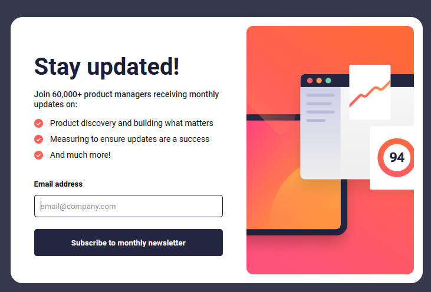

# Frontend Mentor - Newsletter sign-up form with success message solution

This is a solution to the [Newsletter sign-up form with success message challenge on Frontend Mentor](https://www.frontendmentor.io/challenges/newsletter-signup-form-with-success-message-3FC1AZbNrv). Frontend Mentor challenges help you improve your coding skills by building realistic projects. 

## Table of contents

- [Overview](#overview)
  - [The challenge](#the-challenge)
  - [Screenshot](#screenshot)
  - [Links](#links)
- [My process](#my-process)
  - [Built with](#built-with)
  - [What I learned](#what-i-learned)
- [Author](#author)

**Note: Delete this note and update the table of contents based on what sections you keep.**

## Overview

### The challenge

Users should be able to:

- Add their email and submit the form
- See a success message with their email after successfully submitting the form
- See form validation messages if:
  - The field is left empty
  - The email address is not formatted correctly
- View the optimal layout for the interface depending on their device's screen size
- See hover and focus states for all interactive elements on the page

### Screenshot

### Links

- Solution URL: [Newsletter Github](https://github.com/FrontendMentor-Perpydel/Newsletter)
- Live Site URL: [Newsletter](https://news-leta.netlify.app/)

### Built with

- Semantic HTML5 markup
- CSS custom properties
- Flexbox
- CSS Grid
- Mobile-first workflow
- [React](https://reactjs.org/) - JS library
- CSS Modules- For styles

### What I learned

I had a challenge that made me almost give up on the challenge which might seem little but was a bit frustrating and exciting all at the same time. I finally solved it and now I have a solution for everyone who has the same. The challenge was difficulty deploying even when the build and dev was running completely and correctly.

The solution was simply to change the components folder from a pascal-casing to lower-casing. 

## Author

- Website - [Perpetual Meninwa](https://pm-portfolio-drab.vercel.app/)
- Frontend Mentor - [@Perpy-del](https://www.frontendmentor.io/profile/Perpy-del)
- Twitter - [@pominspirational](https://www.twitter.com/pominspirational)

